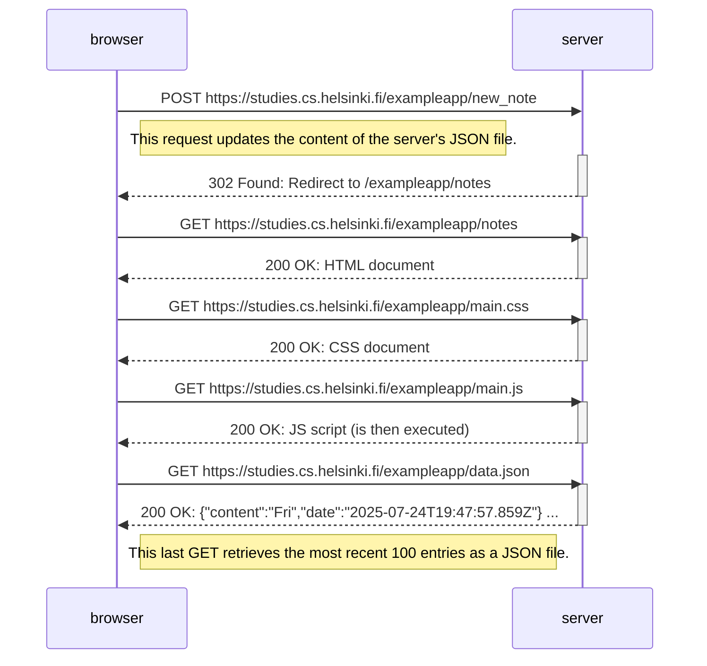

Sequence diagram describing process of submitting a new note on the exampleapp/notes page:

```mermaid
sequenceDiagram
    participant browser
    participant server
    browser->>server: POST https://studies.cs.helsinki.fi/exampleapp/new_note
        Note right of browser: This request updates the content of the server's JSON file.
    activate server
    server-->>browser: 302 Found: Redirect to /exampleapp/notes
    deactivate server

    browser->>server: GET https://studies.cs.helsinki.fi/exampleapp/notes
    activate server
    server-->>browser: 200 OK: HTML document
    deactivate server

    browser->>server: GET https://studies.cs.helsinki.fi/exampleapp/main.css
    activate server
    server-->>browser: 200 OK: CSS document
    deactivate server

    browser->>server: GET https://studies.cs.helsinki.fi/exampleapp/main.js
    activate server
    server-->>browser: 200 OK: JS script (is then executed)
    deactivate server

    browser->>server: GET https://studies.cs.helsinki.fi/exampleapp/data.json
    activate server
    server-->>browser: 200 OK: {"content":"Fri","date":"2025-07-24T19:47:57.859Z"} ...
    deactivate server

    Note right of browser: This last GET retrieves the most recent 100 entries as a JSON file.
```